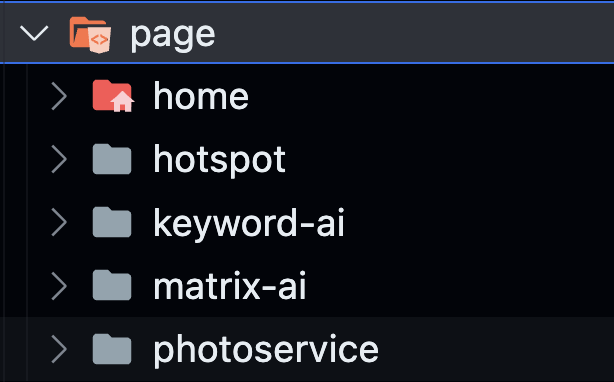

# Molti電商分析網站

這個網站是用[T3 Stack](https://create.t3.gg/)為基底的Project，用Nextjs(Page Router)當作前後端、[Tailwind CSS](https://tailwindcss.com)用來美化、[Prisma](https://prisma.io)來簡化數據管理、[tRPC](https://trpc.io)來建立呼叫數據的router，詳細的docs可以去看他們的官網資訊

## 檔案結構

首先我們來看檔案結構，白話點就是讓你如何在哪個資料夾找到你要的檔案

如果熟悉Nextjs，一定對上面的檔案結構不陌生

我們依序來看src裏面的資料夾檔案

首先最上面的component檔案夾裡有三個資料夾
- `global`(裡面會是像是Navbar之類的components)

- `page`(裡面放的是各個page的components)

- `ui`(裡面可以不用動，是那來存放shadcn/ui的components)

We try to keep this project as simple as possible, so you can start with just the scaffolding we set up for you, and add additional things later when they become necessary.

If you are not familiar with the different technologies used in this project, please refer to the respective docs. If you still are in the wind, please join our [Discord](https://t3.gg/discord) and ask for help.

- [Next.js](https://nextjs.org)
- [NextAuth.js](https://next-auth.js.org)
- [Prisma](https://prisma.io)
- [Tailwind CSS](https://tailwindcss.com)
- [tRPC](https://trpc.io)
