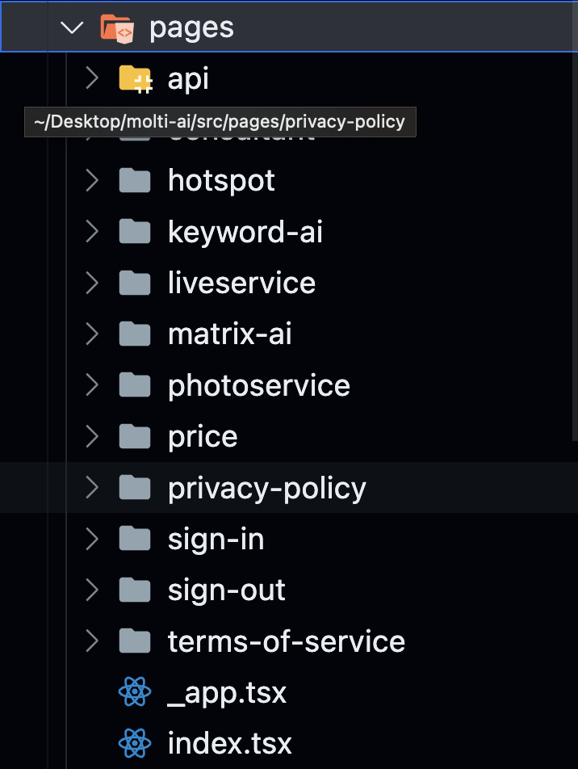

# Molti電商分析網站

這個網站是用[T3 Stack](https://create.t3.gg/)為基底的Application，用Nextjs(Page Router)當作前後端(後端及資料庫尚未實現，如果很熟悉Nodejs可自己將頁面資料遷移)、[Tailwind CSS](https://tailwindcss.com)用來美化、[Prisma](https://prisma.io)來簡化數據管理、[tRPC](https://trpc.io)來建立呼叫數據的router，詳細的docs可以去看他們的官網資訊

## 使用的第三方套件

1.登入系統

- [clerk](https://dashboard.clerk.com/)

我們這裡不用NextAuth，我們改用clerk

clerk是一個現成使用者登入系統的套件，我們公司使用的帳戶是molti life(google) 

後續如果不知道如何使用可以去看[clerk-nextjs-docs](https://clerk.com/docs/quickstarts/nextjs)

2.畫面呈現

- [shadcn/ui](https://ui.shadcn.com/) 這是一個很好用的ui套件

- [material-ui](https://mui.com/material-ui/material-icons/?theme=Outlined&query=scien) 我部分的icon會使用material-ui

- [tremor](https://www.tremor.so/) 目前的圖表都是用tremor上面的現成套件，如果未來[tremor](https://www.tremor.so/)圖表量不夠我們的需求，可使用[Rechart](https://recharts.org/en-US)

3.Form管理(將form資料傳給後端及資料庫)

我們使用shadcn/ui裡的[Form](https://ui.shadcn.com/docs/components/form)，它使用[react-hook-form](https://www.react-hook-form.com/)配zod(type safe)，可以按找他給的範例去客製管理

## 檔案結構

再來我們來看檔案結構，白話點就是讓你如何在哪個資料夾找到你要的檔案

如果熟悉Nextjs，一定對下面的檔案結構不陌生 

我們先依序來看src裏面的資料夾檔案 

### components
首先最上面的components檔案夾裡有三個資料夾 

- `global` (存放會出現在各個route的components) 

這裡面存放會在各個地方出現的components，像是Navbar會在很多route中出現，故可以將他存放到global資料夾裡

- `page` (裡面放的是各個page的components) 

裡面存放的是各個page的components，換句話說是將code切割成數個小部分，將各個部分做成components方便管理，可以將各頁切割或重複使用的components分別依照他在哪一個route存放到page的相對應資料夾裡

ex:我將home主頁的code分成4個components，那就把它們放在components/home/*裡面(＊裡面的資料夾結構就沒有限制了，如果覺得編排的不好可以自己調整方便自己後續找到)

- `ui` (裡面可以不用動，這是拿來存放shadcn/ui的components) 

後續如果要新增shadcn/ui的components，他會自動載入到這個資料夾，我已經載的就不用重新載了，相關資訊請看[shadcn/ui](https://ui.shadcn.com/)

### libs
libs資料夾主要是放各種function 

- `page` 

跟components資料夾裡的page一樣，裡面有各route的檔案夾，各route的檔案夾裡存放該頁的相關function

在我們的例子中，page底下有route為keyword的頁面資料夾，只要是該頁相關的function都可以放在裡面，另外裡面的其他資料夾要怎麼分類都可以自己去調整

- `style` (裡面放的是各個page的components) 

裡面存放關於css的相關function，除非有要新加css相關套件，不然一般來說不會動到

### pages
pages是Nextjs裡的固定資料夾，裡面每一個資料夾代表一個route，詳細資料可以去[Nextjs-page-router](https://nextjs.org/docs/pages/building-your-application/routing/pages-and-layouts) 

- `api` 檔案夾是與trpc連接的api，大部分情況下幾乎不會碰到

- `sign-in` && `sign-up` 這兩個是clerk提供的內建route頁面，有登入跟註冊，除非後續有想要客制登入畫面，不然幾乎不會再動到
- `其他` 各route的名稱

### server
trpc router，未來如果需要使用可以參考[theo的示範](https://www.youtube.com/watch?v=YkOSUVzOAA4&t=4800s&ab_channel=Theo-t3%E2%80%A4gg)

### styles
css檔與icon

### utils 
不用動

### types
由於我們使用Typescript，故需要用到大量的types，這個資料夾可以存放各種types 
 

