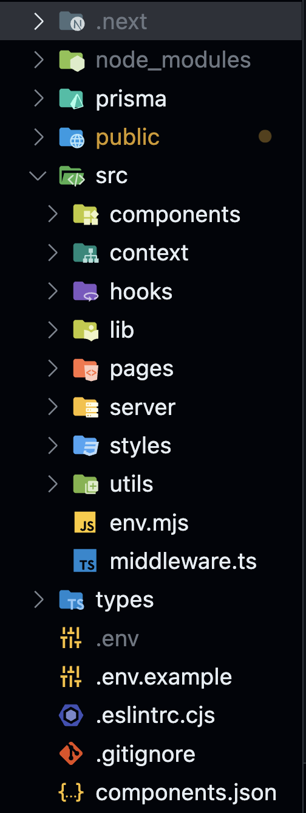
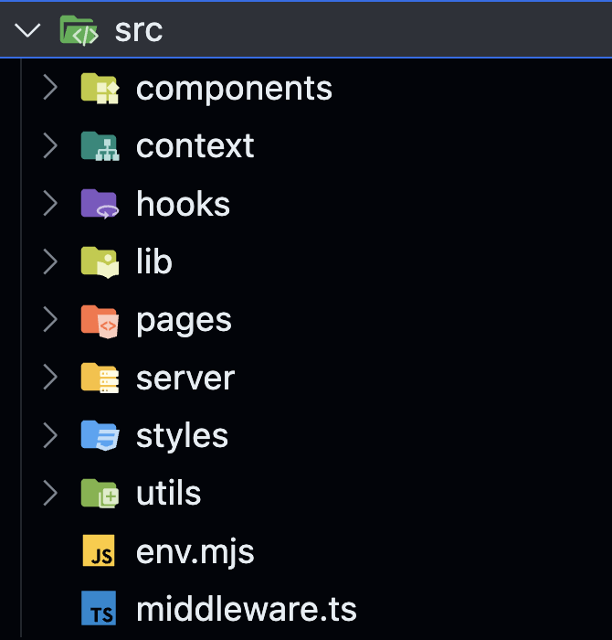

# Molti電商分析網站

這個網站是用[T3 Stack](https://create.t3.gg/)為基底的Project，用Nextjs(Page Router)當作前後端、[Tailwind CSS](https://tailwindcss.com)用來美化、[Prisma](https://prisma.io)來簡化數據管理、[tRPC](https://trpc.io)來建立呼叫數據的router，詳細的docs可以去看他們的官網資訊

## 使用的第三方套件

1.登入系統

- [clerk](https://dashboard.clerk.com/)

clerk是一個現成使用者登入系統的套件，我們公司使用的帳戶是molti life(google) 

後續如果不知道如何使用可以去看[clerk-nextjs-docs](https://clerk.com/docs/quickstarts/nextjs)

2.畫面呈現

- [shadcn/ui](https://ui.shadcn.com/)這是一個很好用的ui套件

- [material-ui](https://mui.com/material-ui/material-icons/?theme=Outlined&query=scien)我部分的icon會使用material-ui

- [tremor](https://www.tremor.so/)目前的圖表都是用tremor上面的現成套件

## 檔案結構

再來我們來看檔案結構，白話點就是讓你如何在哪個資料夾找到你要的檔案

如果熟悉Nextjs，一定對下面的檔案結構不陌生 

我們先依序來看src裏面的資料夾檔案 

### components
首先最上面的components檔案夾裡有三個資料夾 

- `global`(裡面會是像是Navbar之類的components) 

這裡面存放會在global出現的components，像是Navbar會在很多route中出現，故可以將他存放到globsl資料夾裡

- `page`(裡面放的是各個page的components) 

裡面存放的是各個page的components，換句話說是將一頁所有code做切割，將各個部分做成components方便管理，可以將各頁切割或重複使用的components分別依照他在哪一頁存放到page的各個資料夾裡

ex:home主頁有個component，那就把它放在components/home/*裡

- `ui`(裡面可以不用動，是那來存放shadcn/ui的components) 

後續如果要新增shadcn/ui的components，他會自動載入到這個資料夾，相關資訊請看[shadcn/ui](https://ui.shadcn.com/)

### libs
libs資料夾主要是放各種function 

- `page` 

跟components資料夾裡的page一樣，裡面有各頁的檔案夾，各頁的檔案夾裡存放該頁的相關function

在我們的例子中，page底下有route為keyword的頁面資料夾，只要是該頁相關的function都可以放在裡面，另外裡面的其他資料夾要怎麼分類都可以自己去調整，這不是死規範

- `style`(裡面放的是各個page的components) 

裡面存放關於taiwind css的相關function，除非有要新加taiwind css相關套件，不然一般來說不會動到

### pages

- `ui`(裡面可以不用動，是那來存放shadcn/ui的components) 

後續如果要新增shadcn/ui的components，他會自動載入到這個資料夾，相關資訊請看[shadcn/ui](https://ui.shadcn.com/)

